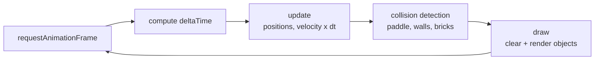

# myTC2005B, Game Development Coursework (Tec de Monterrey)

A collection of JavaScript and HTML5 Canvas games and web integration exercises
built for TC2005B (Building of Software and Devices, Game Development) at
Tec de Monterrey. Everything here runs in the browser on a small, hand written
Canvas engine (no game framework) with vector math, a delta time game loop, and
collision detection.

## Featured: Breakout (with a twist)

A polished Breakout clone where the paddle tilts left and right to aim the ball
into corners. Three levels, each with its own music genre (disco, hip hop, rock),
built on a reusable engine (GameObject, Rect, Vector, TextLabel).

Play it live: https://sant-mell.github.io/myTC2005B/Videojuegos/Breakout/breakout.html

Source: [Videojuegos/Breakout](Videojuegos/Breakout)

| Controls | |
| --- | --- |
| Move paddle | A and D, or arrow keys |
| Tilt paddle | Left and right arrows |
| Start and restart | Space |

## Game loop

The engine drives every game with a delta-time loop: time elapsed since the last
frame scales all movement, so physics stay consistent regardless of frame rate.



## Repository layout

| Path | Contents |
| --- | --- |
| Videojuegos/Breakout | Breakout with tilt mechanic and a reusable Canvas engine (js/libs) |
| VideogamesJS | Smaller Canvas exercises (animation, sprites, physics demos) |
| Web_integration, Web | Web and back end integration exercises (DOM, Node use cases) |
| Tareas, website folders | Assignments and iterative web prototypes |

## Tech

JavaScript (ES6 and later), HTML5 Canvas API, vector math, delta time game loop,
object oriented game objects. No external game framework.

## Run locally

```bash
git clone https://github.com/sant-mell/myTC2005B.git
# open Videojuegos/Breakout/breakout.html in a browser
```

Part of my portfolio at https://sant-mell.github.io. The flagship team game from
this course (a roguelike card game with a Node, Express, and MySQL back end) lives
in [videoGame-TC2005B.501](https://github.com/sant-mell/videoGame-TC2005B.501).
