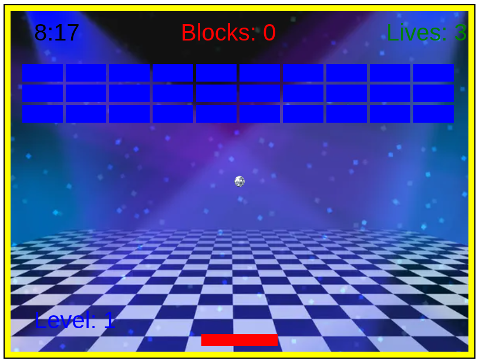

# Breakout music

## Description

This is a implementation of the classic Breakout game with a twitst to it; the player is able to tilt the paddle left and right to affect the direction in which it will face. The game also has 3 stages, each with a differente genre of music in mind.

## Controls 

- Left and right arrow to tilt the paddle
- Space to start the game and restart after losing or winning
- A and D keys to move the paddle from left to right

## Installation

In order to play this game, you must git clone the repository and open the breakout.html file within your computer with your browser of choice.

Clone command:

`git clone https://github.com/sant-mell/myTC2005B.git`

Change to the Breakout directory:

`cd myTC2005B/Videojuegos/Breakout`

Open the html with Brave:

`brave-browser breakout.html`
