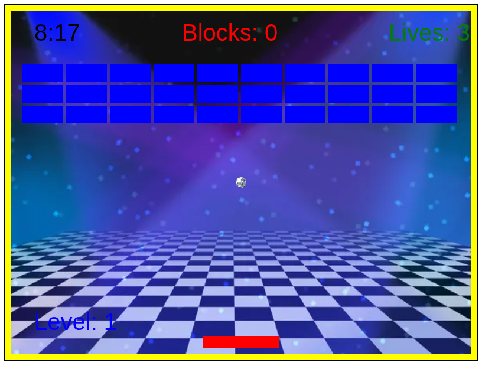

# Breakout

A browser version of the classic Breakout game, written in JavaScript with the HTML5 Canvas. I built it as the final project for the videogames module of TC2005B at Tec de Monterrey.

## The twist

On top of the normal Breakout rules, the paddle can be tilted left or right. When the ball lands on a tilted paddle it bounces off at an angle instead of straight up, so you can aim shots and reach bricks in the corners.

The game has three levels and each one has its own theme and music: disco, hip hop, and rock. Clearing all the bricks takes you to the next level, and clearing level three wins the game.

## Rules

- You start with three lives. Letting the ball fall past the bottom wall costs one life.
- Each level adds another row of bricks, from three rows up to five.
- The ball speeds up a little with every bounce, so later levels get harder.
- There is also a time limit. If it runs out before you clear the bricks, the game is over.

## Controls

- A and D move the paddle left and right.
- Left and right arrow keys tilt the paddle.
- Space serves the ball at the start, and restarts the game after a win or a loss.

## Running it

You need the rest of the myTC2005B repository, because the sprites and the audio live in the VideogamesJS folder next to this one.

Clone the repository:

    git clone https://github.com/sant-mell/myTC2005B.git

Go to the Breakout folder:

    cd myTC2005B/Videojuegos/Breakout

Open the game in a browser:

    brave-browser breakout.html

## How it is built

The game runs on a small engine that is shared across the videogames module: a Vector class for the math, a GameObject base class for the paddle, ball, bricks and walls, and a game loop driven by requestAnimationFrame with delta time so the speed stays consistent between frames. Collisions use axis aligned box overlap tests, and the paddle decides the bounce direction based on its tilt.

Santiago Aguilar Mello, 2025.
